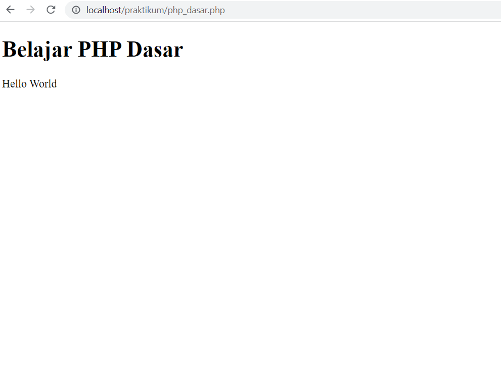

# PROJECT PRAKTIKUM 1

**_Nama: Indi Alya Putri_** <br/>
**_Nim : 312110137_** <br/>
**_Kelas : TI.21.A3_** <br/>

<br/>

## **PHP dasar**


### _Code :_

```php
<body>
  <h1>Belajar PHP Dasar</h1>
  <?php
    echo "Hello World";
  ?>
</body>
```

### _Output :_



</br></br>

## **Menggunakan Variable**


### _Code :_

```php
<body>
  <h1>Menggunakan Variable</h1>
 <?php
echo "Hello World";
?>
<h3>Menggunakan variable</h3>

<?php
$nim = "312110137";
$nama = 'Indi Alya Putri';
echo "NIM : " . $nim . "<br>";
echo "Nama : $nama";
?>
</body>
```

### _Output :_


</br></br>

## **Predefine Variable**


### _Code :_

```php
<body>
  <h1>Predefine Variable</h1>
  <?php
    echo 'Selamat Datang ' . $_GET['nama'];
  ?>
</body>
```

### _Output :_


</br></br>

## **Form Input**


### _Code :_

```php
<body>
  <h2>Form Input</h2>
  <form method="post">
    <label>Nama: </label>
    <input type="text" name="nama">
    <input type="submit" name="kirim">
  </form>
  <?php
    if(isset($_POST["kirim"])){
      echo 'Selamat Datang ' . $_POST['nama'];
    }
  ?>
</body>
```

### _Output :_


</br></br>

## **Operator**


### _Code :_

```php
<body>
  <h2>Operator</h2>
  <?php
    $gaji = 1000000;
    $pajak = 0.1;
    $thp = $gaji - ($gaji*$pajak);
    echo "Gaji sebelum pajak = Rp. $gaji <br>";
    echo "Gaji yang dibawa pulang = Rp. $thp";
  ?>
</body>
```

### _Output :_


</br></br>

## **Kondisi IF**


### _Code :_

```php
<body>
  <h2>Kondisi IF</h2>
  <?php
    $nama_hari = date("l");
    if ($nama_hari == "Sunday") {
      echo "Minggu";
    } elseif ($nama_hari == "Monday") {
      echo "Senin";
    } else {
      echo "Selasa";
    }
  ?>
</body>
```

### _Output :_


</br></br>

## **Kondisi Switch**


### _Code :_

```php
<body>
  <h2>Kondisi Switch</h2>
  <?php
    $nama_hari = date("l");
    switch ($nama_hari) {
      case "Sunday":
        echo "Minggu";
        break;
      case "Monday":
        echo "Senin";
        break;
      case "Tuesday":
        echo "Selasa";
        break;
      default:
        echo "Sabtu";
    }
  ?>
</body>
```

### _Output :_


</br></br>

## **Perulangan for**


### _Code :_

```php
<body>
  <h2>Perulangan for</h2>
  <?php
    echo "Perulangan 1 sampai 10 <br />";
    for ($i = 1; $i <= 10; $i++) {
      echo "Perulangan ke: " . $i . '<br />';
    }
    echo "Perulangan Menurun dari 10 ke 1 <br />";
    for ($i = 10; $i >= 1; $i--) {
      echo "Perulangan ke: " . $i . '<br />';
    }
  ?>
</body>
```

### _Output :_


</br></br>

## **Perulangan while**


### _Code :_

```php
<body>
  <h2>Perulangan while</h2>
  <?php
    echo "Perulangan 1 sampai 10 <br />";
    $i = 1;
    while ($i <= 10) {
      echo "Perulangan ke: " . $i . '<br />';
      $i++;
    }
  ?>
</body>
```

### _Output :_


</br></br>

## **Perulangan dowhile**


### _Code :_

```php
<body>
  <h2>Perulangan dowhile</h2>
  <?php
    echo "Perulangan 1 sampai 10 <br />";
    $i = 1;
    do 
      echo "Perulangan ke: " . $i . '<br />';
      $i++;
    } while ($i <= 10);
  ?>
</body>
```

### _Output :_


</br></br>

## **TUGAS**


### _Code :_

```php

<body>
    <h3>FORM INPUT</h3>
    <form method="post">
        <label>Nama : </label><br>
        <input type="text" name="nama"><br><br>
        <label>Tanggal Lahir : </label><br>
        <input type="date" name="tgl"><br><br>
        <label>Pekerjaan : </label><br>

        <!-- jenis jenis pekerjaan  -->
        <select name='pekerjaan'>
            <option value="">~ Jenis Pekerjaan ~</option>
            <option value="IT support">1. IT support</option>
            <option value="Data Scientist">2. Data Scientist</option>
            <option value="Web Developer">3. Web Developer</option>
            <option value="Programmer">4. Programmer</option>
            <option value="Dosen">5. Dosen</option>
        </select><br><br>
        <button type="submit">SUBMIT</button>
    </form>
    <h3>Output</h3>

    <?php
    // output nama, umur, pekerjaan dan gaji
    echo 'Nama Anda : ' . $_POST['nama'];
    $tgl = $_POST['tgl'];
    $lahir = new DateTime($tgl);
    $hari_ini = new DateTime();
    $diff = $hari_ini->diff($lahir);
    echo "<br> Umur Anda : " . $diff->y . " Tahun";
    echo "<br>";
    echo "Pekerjaan Anda : " . $_POST['pekerjaan'];
    $pekerjaan = $_POST['pekerjaan'];
    echo "";

    if ($pekerjaan == "IT support") {
        echo '<br> Gaji Anda : Rp.5.000.000';
    } elseif ($pekerjaan == "Data Scientist") {
        echo '<br> Gaji Anda : Rp.10.000.000';
    } elseif ($pekerjaan == "Web Developer") {
        echo '<br> Gaji Anda : Rp.7.000.000';
    } elseif ($pekerjaan == "Programmer") {
        echo '<br> Gaji Anda : Rp.15.000.000';
    } elseif ($pekerjaan == "Dosen") {
        echo '<br> Gaji Anda : Rp.5.000.000';
    }
    ?>
</body>
  
```

### _Output :_


### _Penjelasan :_

- pada from pengambilan data menggunakan method `post`
- pada saat button sumbit di klick maka semua data yang berada di dalam form akan dikirim kepada page ini sendiri dengan http method `post`
- lalu pada script php di menangkap `event` submit dari button yang bernama kirim
- mendeklarasikan variable nama, tanggal lahir dan pekerjaan. dengan mengambil value dari isi method `post` yang sudah di submit
- mendeklarasikan variable tanggal_sekarang dengan mengambil object data dengan format `Y-m-d`
- membuat fungsi perhitungan usia yang memiliki parameter `tanggal_lahir` dan `tanggal_sekarang` dengan memanfaatkan method bawaan dari php yaitu `diff` untuk menghitung selisih waktu dari tanggal sekarang dan tanggal lahir
- membuat pengkondisiian pekerjaan untuk mengetahui gaji dengan menggunakan `switch case`
- menampilkan `Hasil Inputan` dengan tag `table`
